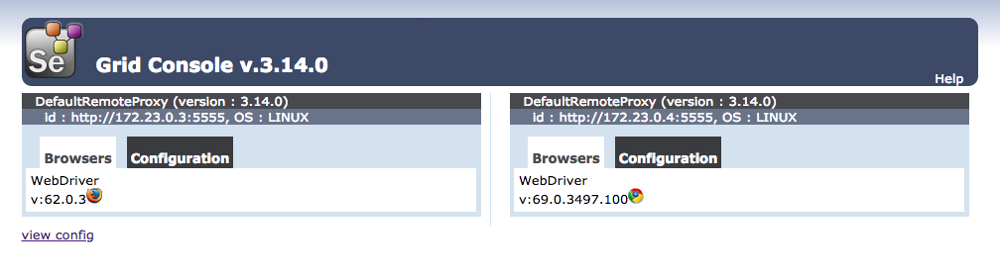
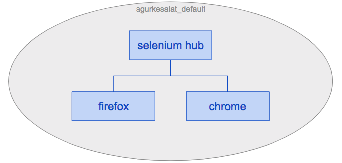
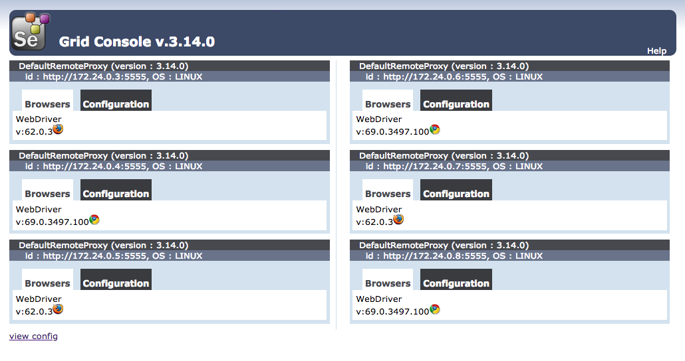
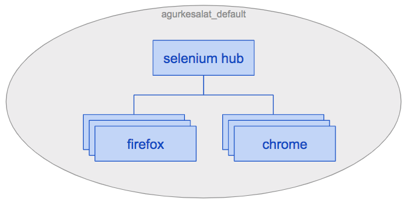
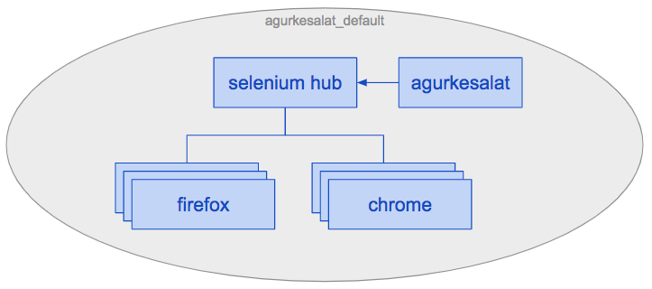

agurkesalat
===========

Kom hurtigt i gang med funktionelle tests i Ruby, Cucumber, Selenium og Docker.


#### Indhold

* [Kom i gang](#kom-i-gang)
* [Start et selenium netværk](#start-et-selenium-netværk)
  - [Start flere nodes på samme tid](#start-flere-nodes-på-samme-tid)
  - [Stop selenium netværket](#stop-selenium-netværket)
* [Bygg en container for at køre dine tests](#bygg-en-container-for-at-køre-dine-tests)
* [Kør dine tests indenfor din container](#kør-dine-tests-indenfor-din-container)
  - [Test i Chrome eller Firefox](#test-i-chrome-eller-firefox)
  - [Test flere scenarier parallelt](#test-flere-scenarier-parallelt)
  - [Test med en anden Selenium Grid](#test-med-en-anden-selenium-grid)
  - [Test på forskellige browsers med en Selenium Grid](#test-på-forskellige-browsers-med-en-selenium-grid)
* [Skriv nye tests](#skriv-nye-tests)
  - [Når du vil debug siden](#når-du-vil-debug-siden)
  - [Når du vil kigge indenfor containeren](#når-du-vil-kigge-indenfor-containeren)
  - [Når du har brug for en ny gem](#når-du-har-brug-for-en-ny-gem)


Kom i gang
----------

Du skal have brug for [Git](https://git-scm.com/downloads) og [Docker](https://www.docker.com/get-started)

Klon det her repository med git.

    git clone git@github.com:sermoa/agurkesalat.git
    cd agurkesalat


Start et selenium netværk
-------------------------

Vi bruger filen `docker-compose.yml` til at starte 3 Docker containers:

* selenium_hub
* firefox
* chrome

Sådan:

    docker-compose up -d

Besøg http://localhost:4444/grid/console om at se dit selenium netværk.



Her har du skabet et selenium netværk med 3 containers: en selenium hub og 2 selenium nodes, en til firefox browser, og en til chrome browser. Containerne er klar til at køre tests for dig.

Containerne eksisterer i et netværk, der hedder `agurkesalat_default`.




### Start flere nodes på samme tid

Hvis du vil, kan du tilføje flere nodes af firefox og chrome. Det kan være nyttigt når du vil [køre flere tests parallelt](#test-flere-scenarier-parallelt).

    docker-compose up -d --scale firefox=3 --scale chrome=3

Nu har du 3 firefox nodes og 3 chrome nodes.





Du kan godt se hvor mange docker containers kører på tidspunkt:

    docker container ls


### Stop selenium netværket

Når du er færdig med netværket, stopper du det sådan:

    docker-compose down


Bygg en container for at køre dine tests
----------------------------------------

Vi bruger filen `Dockerfile` til at bygge en container med Ruby og Cucumber. Vi kan tagge den som `agurkesalat` (et andet navn er også okay, men husk navnet!)

    docker build -t agurkesalat .


Kør dine tests indenfor din container
-------------------------------------

    docker run -t --network agurkesalat_default agurkesalat

Vi kører containeren `agurkesalat` og bruger netværket `agurkesalat_default` som blev skabet før med `docker-compose` kommandoen.

Nu har du en anden container i det samme netværk, som kan tale med din selenium hub. Din selenium hub skal vælge en node (firefox eller chrome) der kan køre dine tests.




### Test i Chrome eller Firefox

Som standard kører testerne i Firefox. Sådan kan du styre testerne ved Chrome:

    docker run -t --network agurkesalat_default agurkesalat cucumber --profile chrome


### Test flere scenarier parallelt

Vær sikker på at [flere Chrome eller Firefox nodes kører](#start-flere-nodes-på-samme-tid).

Nu kan du køre tests parallelt, i Firefox:

```bash
docker run -t --network agurkesalat_default agurkesalat \
  parallel_cucumber features -n 3 --group-by scenarios -o '-p firefox'
```

Eller Chrome:

```bash
docker run -t --network agurkesalat_default agurkesalat \
  parallel_cucumber features -n 3 --group-by scenarios -o '-p chrome'
```


### Test med en anden Selenium Grid

Du har ikke brug for at køre din egen Selenium Grid og nodes i containerer, når der er en anden Selenium Grid tilgængelig til dig. Brug derfor en miljøvariable i stedet for dit eget netværk:

```bash
docker run -t --env SELENIUM_HUB_ADDR=10.112.13.16 agurkesalat \
  parallel_cucumber features -n 3 --group-by scenarios -o '-p firefox'
```

```bash
docker run -t --env SELENIUM_HUB_ADDR=10.112.13.16 agurkesalat \
  parallel_cucumber features -n 3 --group-by scenarios -o '-p chrome'
```


### Test på forskellige browsers med en Selenium Grid

De følgende profiles er tilgængelige, hvis du har nodes der kan køre dem:

  * chrome
  * firefox
  * safari
  * edge
  * ie
  * linux_chrome
  * linux_firefox
  * osx_chrome
  * osx_firefox
  * osx_safari
  * windows_chrome
  * windows_firefox
  * windows_edge
  * windows_ie


Skriv nye tests
---------------

Normalt kører testerne som blev bygget i containeren. Når du ikke vil bygge kontinuerligt en nye container image, kan du montere en lokale mappe inden containeren sådan:

    docker run -t --network agurkesalat_default --volume `pwd`/:/arbejde agurkesalat

Jeg kan godt lide at køre kun en test ad gangen når jeg skriver nye tests. Jeg bruger en `@wip` tag og kører cucumber sådan:

    docker run -t --network agurkesalat_default --volume `pwd`/:/arbejde agurkesalat cucumber --tags @wip


### Når du vil debug siden

Simpelthen skriv `debug page` i dine trin definitioner. Et skærmbillede skal findes i en `skaermbilleder` mappe.

```ruby
Givet("jeg er på radio-oversigten") do
  visit '/radio/oversigt'
  accept_cookies
  debug page
end
```

Husk at fjerne debug trinnet bagefter.


### Når du vil kigge indenfor containeren

Du kan køre bash indenfor containeren sådan:

    docker run -ti --network agurkesalat_default --volume `pwd`/:/arbejde agurkesalat /bin/bash


### Når du har brug for en ny gem

Tilføj den til `Gemfile` og kør den her kommando til at opdatere `Gemfile.lock`:

    docker run --rm --volume `pwd`:/arbejde --workdir /arbejde ruby:2.5.1 bundle lock --update

Husk at genbygge din agurkesalat container.

    docker build -t agurkesalat .
